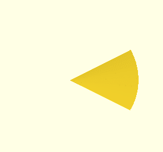

# OpenSCAD animations

A collection of animations I made in OpenSCAD to visualize geometric concepts
encountered in math and physics.

- [cone-lateral-area](cone-lateral-area) –
  visualize how a circular "wedge" shape bends into a cone & vice versa, as
  well as how wedge angle/shape affects the resulting cone "sharpness"

  
